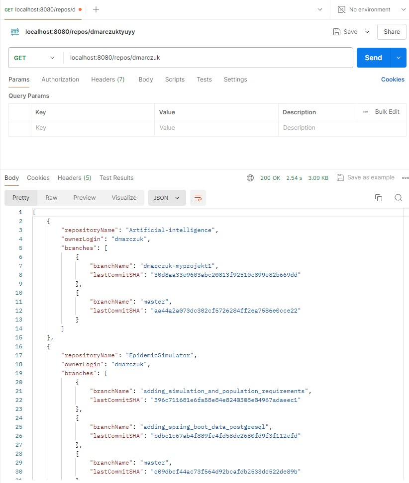
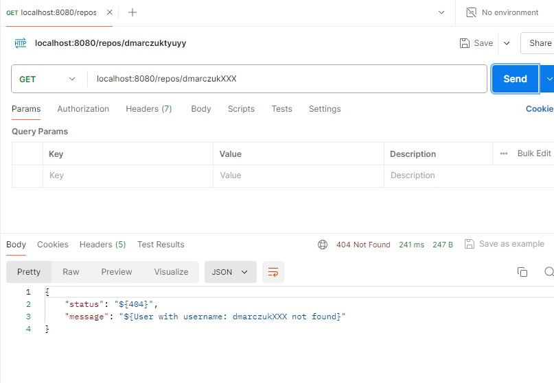

# GitHubManager

## About project
Spring Boot application that lists non-forked GitHub repositories 
for a given user, including branch and last commit information. Next methods
could be implemented in the future.

## Main responsibilities application
<ul>
<li>Get list of repositories for given user</li>
</ul>

## Usage:

### Endpoints
- `GET "/repos/{username}"` - Fetches all non-forked repositories for a given GitHub username, including branch and last commit details.

### Postman screenshots:
Screenshot of method GET "/repos/dmarczuk" which return list of not forked repositories for user dmarczuk

Screenshot of method GET "/repos/dmarczukXXX" which return error response, because user not found

## Technologies used in project

Code: <br>
  
  
  


Test: <br>


<br>

## Installation and run
<li>Cloning the Repository</li>

```
git clone https://github.com/dmarczuk/GithubManager.git
```

<li>Building the Project</li>

```
mvn clean install
```

<li>Running the Application</li>

```
mvn spring-boot:run
```


## In future
Currently, I am working for unit tests and
the GitHub authorization by token. </br>
In the future it possible to add some other methods

